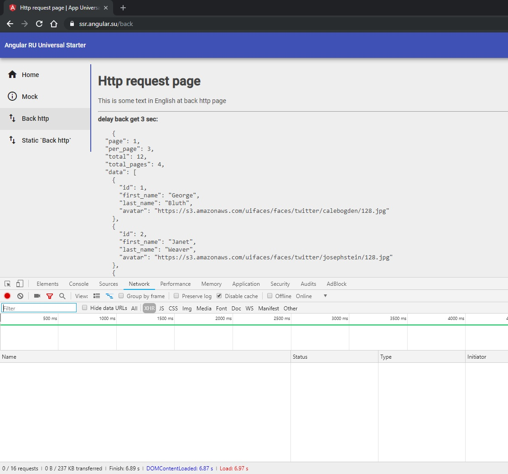

# ngx-transfer-http
Implementation http for Angular universal work based on TransferState

The package can be installed using:

`npm install @gorniv/ngx-transfer-http --save`

# TransferHttpModule

in `app.module.ts`

```ts
import { TransferHttpModule, TransferHttpService } from '@gorniv/ngx-transfer-http';


@NgModule({
  imports: [
    BrowserModule.withServerTransition({ appId: 'my-app' }),
    HttpClientModule,
    TransferHttpModule
    ...
```

# TransferHttpService

in `app.module.ts`

```ts
import { TransferHttpModule, TransferHttpService } from '@gorniv/ngx-transfer-http';

@NgModule({
  providers: [TransferHttpService],
  imports: [
   ...
})
```

use in component or service:

```ts
import { TransferHttpService } from '@gorniv/ngx-transfer-http';

...

constructor(private http: TransferHttpService){}

getData(): void{
    this.http.get<MyObjectModel>('https://reqres.in/api/users?delay=1').subscribe(result => {
      console.log(result);
      ...
    });

}

```

check:
1) Node server console
2) Open network in developer tools browser and your XHR network must be empty


